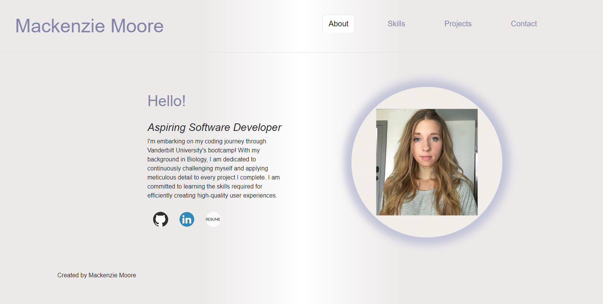
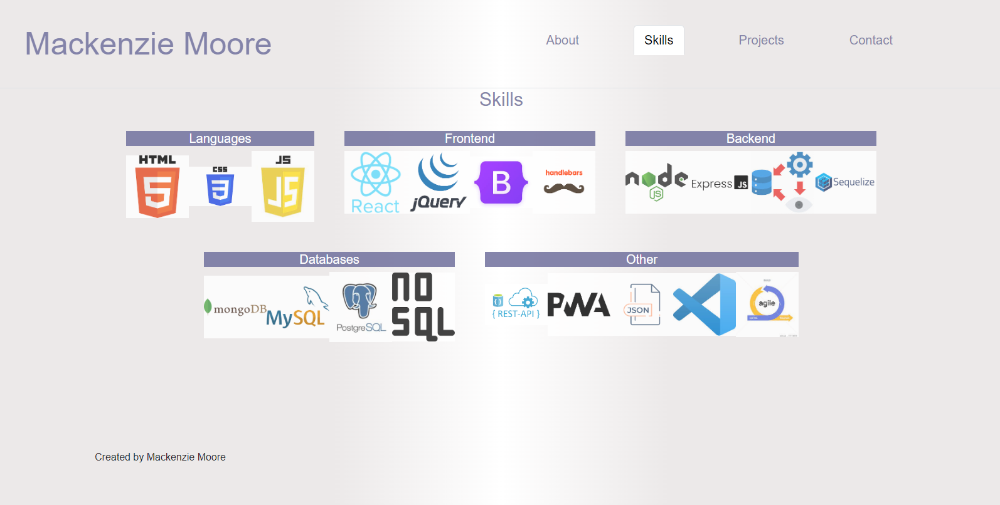
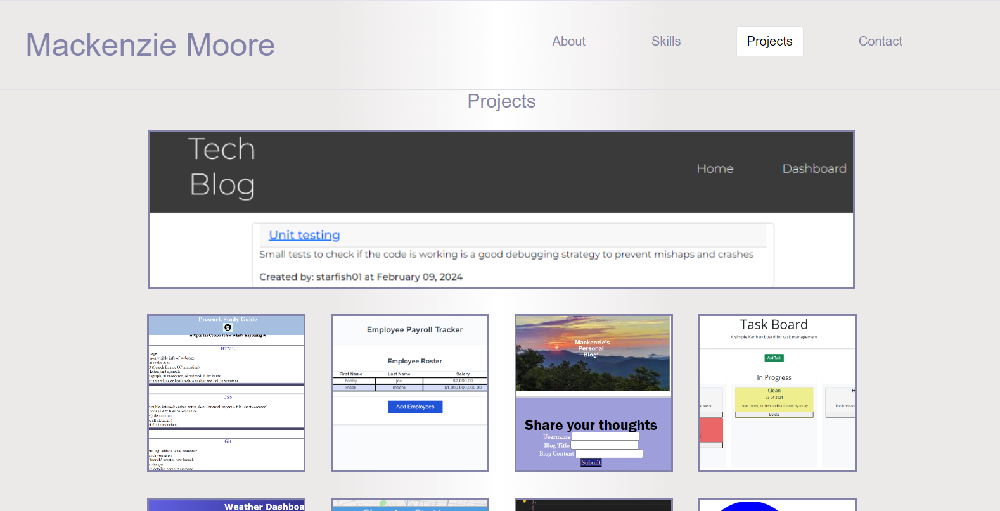
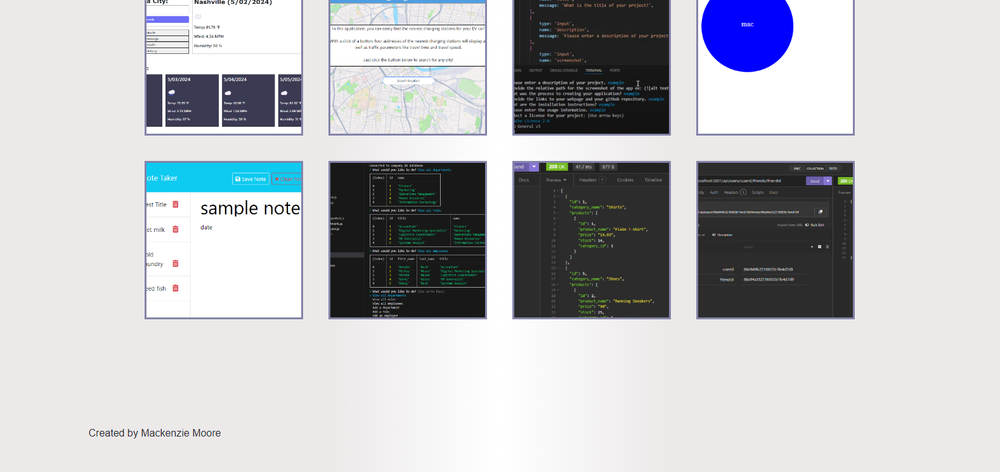
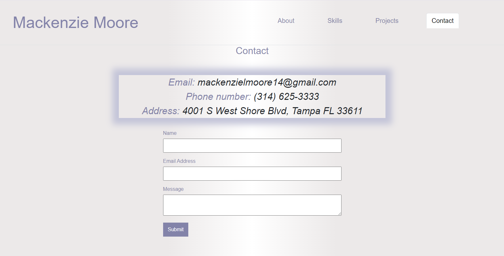

# Mack-portfolio

## Description

My Portfolio. Welcome!

## Table of Content
  -[Description](#Description)
  -[Process](#Process)
  -[Usage](#Usage)
  -[Licenses](#Licenses)
  -[Contribution](#Contribution)
  -[Acknowledgement](#Acknowledgement)
  -[Questions](#Questions)

## Process

Created from React. Main.jsx includes five different pages: About, Skills, Projects, Contact, and an Error Page. Each page feature a header
and footer component. Assets folder includes all the images and icons. Projects page includes each project with github link and description.
Contact page includes my emial, number, address, and a contact form.

## Usage

A portfolio to display my work.

## License

MIT

## Contribution
  
Contact me by email provided in Questions section

## Acknowledgement

Project was done by the knowledge learned from Vanderibilt bootcamp.

## Questions
  
Contact with questions at:
  
Email: mackenzielmoore14@gmail.com
Click [here](https://github.com/mackemo) for Github account.